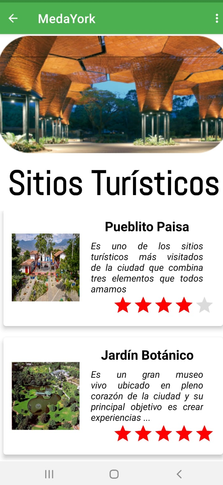
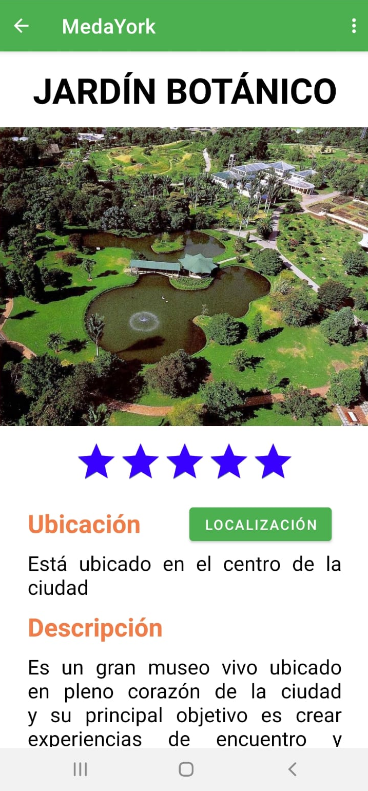
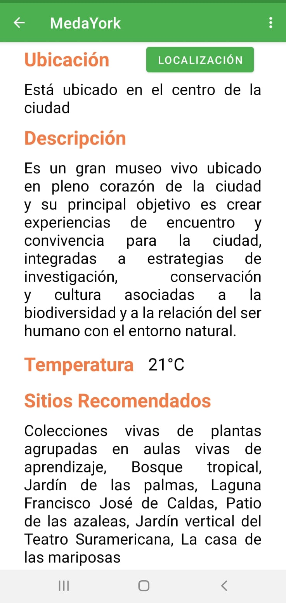
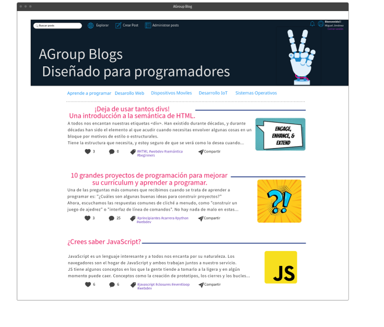
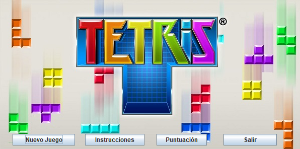
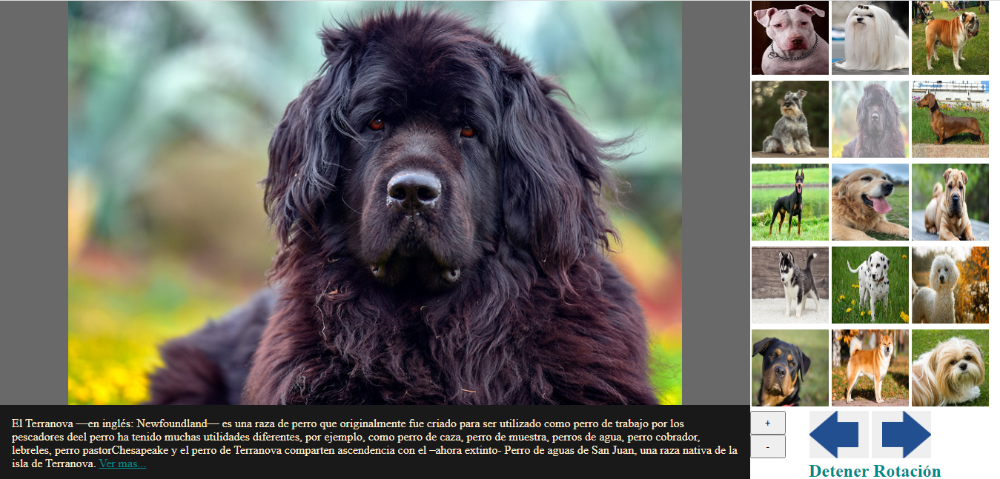
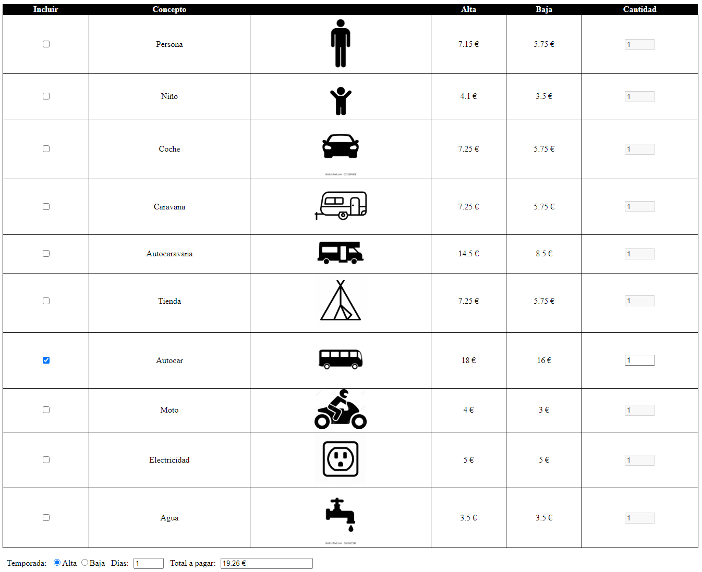
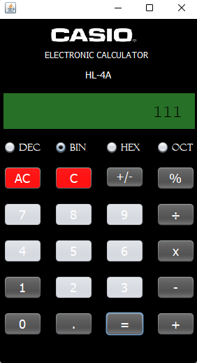
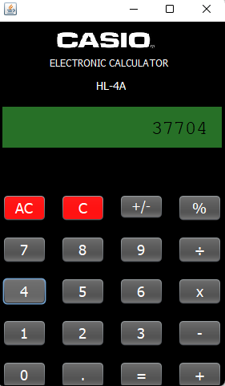

# 👨‍💻 Javier Santiago Borbón  
### Full Stack Developer | IT Support Specialist | React · Next.js · Angular · Python · SQL

---

## 🌟 About Me
I’m a **Software Engineer / Systems Engineer in training** with experience in **web development**, **IT support**, and **VR-enabled projects**. I love building **robust, scalable** applications and learning continuously.

---

## 🛠️ Tech Stack

**Frontend**  

**Backend**  

**Databases**  

**Mobile & DevOps**  

---

## 📊 Stats

  

---

## 🚀 Featured Projects

### **FRIKI ZONE**

<h4>E-commerce built with Next.js, Prisma, and PostgreSQL for anime/comics/gaming.</h4>

Categories, advanced search/filters, wishlist, cart, and an admin panel. Responsive UI with Framer Motion animations.

🔗 <a href="https://github.com/jsborbon/friki-shop">Repository</a>

### **MEDAYORK**

<h4>Android tourist app for Medellín (Colombia).</h4>

Discover places and info for travelers.

🔗 <a href="https://github.com/MedaYork/MedaYork">Repository</a>

### **BLOGS – CMS**

<h4>CMS for dev blogs.</h4>

Python backend (encryption, email, DAO). Easy content management for tech posts.

🔗 <a href="https://github.com/VelasquezDaniel/Grupo-A---Gestion-blogs-">Repository</a>

### **TETRIS**

<h4>Classic Tetris in Java with user & developer manuals.</h4>
🔗 <a href="https://github.com/jsborbon/Tetris">Repository</a>

---

## 📚 More Projects (expand to view)

<strong>Click to expand</strong>

### **SLIDESHOW**

<h4>Image viewer fed by Wikipedia API.</h4>

Controls for next/prev and pause auto-play.

🔗 <a href="https://github.com/jsborbon/Visor-Imagenes">Repository</a>

### **RITUALS**

<h4>Rituals.com website clone using HTML & CSS.</h4>
🔗 <a href="https://github.com/jsborbon/Rituals">Repository</a>

### **CAMP COST CALCULATOR**

<h4>Calculator for total stay cost by season, days, items, and quantities.</h4>
🔗 <a href="https://github.com/jsborbon/Camping-Presupuesto">Repository</a>

### **TIC TAC TOE**

<h4>Tic Tac Toe in Java.</h4>
🔗 <a href="https://github.com/jsborbon/Triqui">Repository</a>

### **ROBOTIC ARM**

<h4>3D robotic arm with controllable joints; shows axes coordinates.</h4>
🔗 <a href="https://github.com/jsborbon/Simulacion-Brazo-Robotico">Repository</a>

### **CALCULATOR WITH NUMBER BASE CONVERSION**

<h4>Operate with numbers from different bases.</h4>
🔗 <a href="https://github.com/jsborbon/Calculadora-diferentes-bases">Repository</a>

### **CALCULATOR**

<h4>Basic Java calculator.</h4>
🔗 <a href="https://github.com/jsborbon/Calculadora">Repository</a>

---

## 📬 Contact
  
  
  
  

[⬆ Back to top](#-javier-santiago-borbón)
