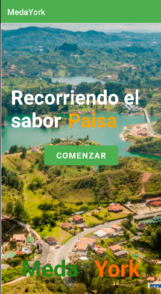

## <b>Hey!</b>
## My name is Javier Borbon ✌️😎

### <strong>About me</strong> 

I am a Multiplatform Application Development student at Nebrija University.
I like to develop and code. Always learning with the aim of creating a solution to improve people's quality of life. I have taken some courses on development and I have learned some languages, like:

* HTML
* CSS
* JAVASCRIPT
* JAVA 
* PYTHON
* C / C++

### **Contact**

[][linkedin] 
[][github]

[linkedin]:https://www.linkedin.com/in/jsborbon/
[github]:https://github.com/jsborbon

### **Stats**

### <strong>My proyects</strong>

- [SLIDESHOW](#slideshow)
- [RITUALS](#rituals)
- [MEDAYORK](#medayork)
- [CAMP COST CALCULATOR](#camp-cost-calculator)
- [BLOGS - CMS](#blogs---CMS)
- [TIC TAC TOE](#tic-tac-toe)
- [TETRIS](#tetris)
- [ROBOTIC ARM](#robotic-arm)
- [CALCULATOR WITH NUMBER BASE CONVERSION](#calculator-with-number-base-conversion)
- [CALCULATOR](#calculator)

## **Proyects**

#### **SLIDESHOW**

<h3>This project displays a list of images.</h3>

Each photo has information about itself that has been extracted from Wikipedia directly through its API. In addition, the program has two buttons to control the image to display and an option to stop automatic display. 

Visit the project <a href="https://github.com/jsborbon/Visor-Imagenes">here...</a>

 

#### **RITUALS**

<h3>
This project is a website based on <a href="https://www.rituals.com/">Rituals</a>. It was made using HTML and CSS. 
</h3>

Visit the project <a href="https://github.com/jsborbon/Rituals">here...</a>

 

#### **MEDAYORK**

<h3>This is a tourist app for Android where you can find travel information about Medellin, Colombia.</h3>

Visit the project <a href="https://github.com/MedaYork/MedaYork">here...</a>

 

#### **CAMP COST CALCULATOR**

<h3>This project calculates how much you have to pay in a place, depending on the season, the number of days, items, and their quantity.</h3>

Visit the project <a href="https://github.com/jsborbon/Camping-Presupuesto">here...</a>

 

#### **BLOGS - CMS**

<h3>This project displays a list of images.</h3>

Each photo has information about itself that has been extracted from Wikipedia directly through its API. In addition, the program has two buttons to control the image to display and an option to stop automatic display. 

Visit the project <a href="https://github.com/VelasquezDaniel/Grupo-A---Gestion-blogs-">here...</a>

 

#### **TIC TAC TOE**

<h3>This project displays a list of images.</h3>

Each photo has information about itself that has been extracted from Wikipedia directly through its API. In addition, the program has two buttons to control the image to display and an option to stop automatic display. 

Visit the project <a href="https://github.com/jsborbon/Triqui">here...</a>

 

#### **TETRIS**

<h3>This project displays a list of images.</h3>

Each photo has information about itself that has been extracted from Wikipedia directly through its API. In addition, the program has two buttons to control the image to display and an option to stop automatic display. 

Visit the project <a href="https://github.com/jsborbon/Tetris">here...</a>

 

#### **ROBOTIC ARM**

<h3>This project displays a list of images.</h3>

Each photo has information about itself that has been extracted from Wikipedia directly through its API. In addition, the program has two buttons to control the image to display and an option to stop automatic display. 

Visit the project <a href="https://github.com/jsborbon/Simulacion-Brazo-Robotico">here...</a>

 

#### **CALCULATOR WITH NUMBER BASE CONVERSION**

<h3>This project displays a list of images.</h3>

Each photo has information about itself that has been extracted from Wikipedia directly through its API. In addition, the program has two buttons to control the image to display and an option to stop automatic display. 

Visit the project <a href="https://github.com/jsborbon/Calculadora-diferentes-bases">here...</a>

 

#### **CALCULATOR**

<h3>This project displays a list of images.</h3>

Each photo has information about itself that has been extracted from Wikipedia directly through its API. In addition, the program has two buttons to control the image to display and an option to stop automatic display. 

Visit the project <a href="https://github.com/jsborbon/Calculadora">here...</a>

 

[Ir arriba](#)